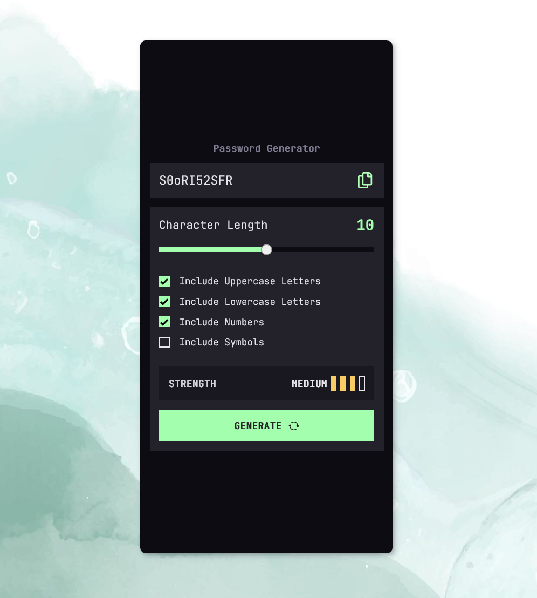
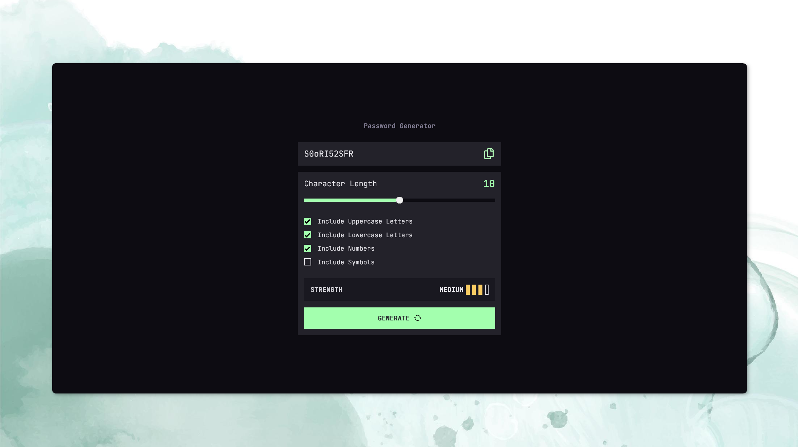

## Table of contents
- [Screenshots](#screenshots)
- [Built with](#built-with)
- [The challenge](#the-challenge)
- [Author](#author)

### Screenshots

#### Mobile

#### Desktop

## Built with
- Semantic HTML5 markup
- CSS custom properties
- SASS
- Mobile-first workflow
- BEM
- JavaScript
- zxcvbn

**Wanna look how it works?** 
[Check it out!](https://vanesa-r.github.io/password-generator/) :point_left:

## The challenge
This is a solution to the [Password Generator App Challenge on Frontend Mentor](https://www.frontendmentor.io/challenges/password-generator-app-Mr8CLycqjh). Frontend Mentor challenges help you improve your coding skills by building realistic projects.

Users should be able to:

- Generate a password based on the selected inclusion options
- Copy the generated password to the computer's clipboard
- See a strength rating for their generated password
- View the optimal layout for the interface depending on their device's screen size
- See hover and focus states for all interactive elements on the page

## Author

Vanesa Rodríguez
